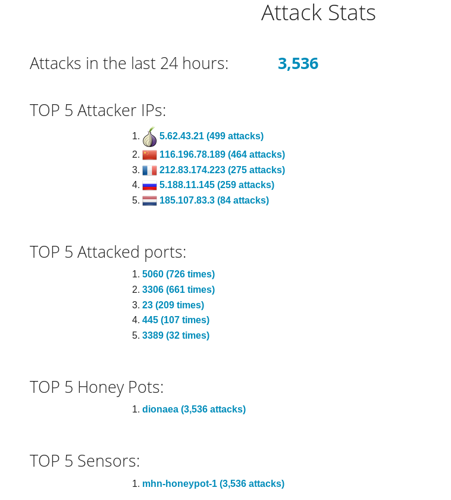

Which Honeypot(s) you deployed:
The Dionaea honeypot.

Any issues you encountered:
Setting up the honeypot in the in cloud shell did not work. Charts did not work work on the Dionaea honeypot.
    
A summary of the data collected: 
Number of attacks: 12,500+ 
Src ips appeared from: Japan, Russia, China, Turkey, Spain, USA, India, Brazil, Mexico, France

